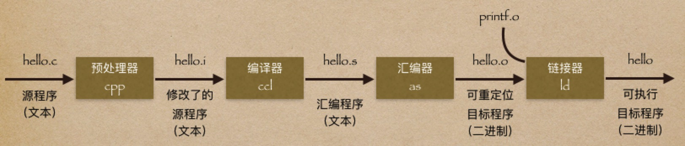
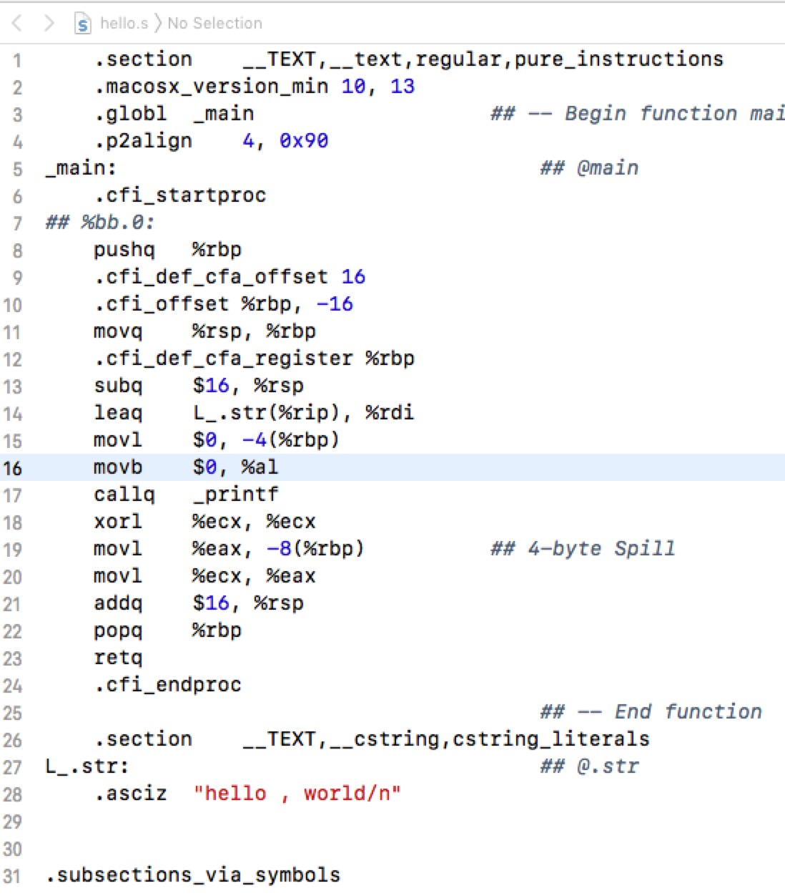

# 1、从Hello World开始

```c
#include <stdio.h>
int main()
{
    printf("hello , world/n");
    return 0;
}
```

让我们通过跟踪 `hello` 程序的生命周期来开始对系统的学习----从它被程序员创建开始，到在系统上运行，输出简单的消息，然后终止。

### **信息就是位 + 上下文**

`hello` 程序的生命周期是从一个**源程序（或者说源文件**）开始的，即程序员通过编辑器创建并保存的文本文件，文件名为 `hello.c` 。源程序实际上就是一个由 `0` 和 `1` 组成的位（又称为比特）序列，8个位被组织成一组，称为字节。每个字节表示程序中的某些文本字符。

这里展示的是 `hello.c` 程序的 `ASCII` 码表示：


像 `hello.c` 这样只由 `ASCII` 字符构成的文件称为**文本文件，所有其他文件都成为二进制文件**。

### **程序被其他程序翻译成不同的格式**

为了在系统上运行 `hello.c` 程序，每条 `C` 语句都必须被其他程序转化为一系列的**低级机器语言指令**。然后这些指令按照一种称为可执行目标程序的格式打好包，并以二进制磁盘文件的形式存放起来。目标程序也被称为可执行目标文件。

```text
linux> gcc -o hello hello.c
```

在这里 `GCC` 编译器驱动程序读取源程序文件 `hello.c`，并将它翻译成一个可执行目标文件 `hello` 。这个翻译过程可以分为四个阶段完成，执行这四个阶段的程序（**预处理器、编译器、汇编器和链接器**）一起构成了编译系统（`compilation system`）。



* 预处理阶段。预处理器（`cpp`）根据以字符 `#` 开头的命令，修改原始的 `C` 程序。比如，`hello.c` 中第一行命令：

```text
#include <stdio.h>
```

高速预处理器读取系统头文件 `stdio.h` 的内容，并把它直接插入程序文本中。结果就得到了另一个 `C` 程序，通常是以 `.i` 作为文件扩展名。

* 编译阶段。编译器（`ccl`）将文本文件 `hello.i` 翻译成文本文件 `hello.s`，它包含一个**汇编语言程序**。该程序包含函数 `main` 的定义，如下所示：  每条语句都以一种文本格式描述了一条低级机器语言指令。汇编语言为不同高级语言的不同编译器提供了通用的输出语言。



* 汇编阶段。接下来，汇编器（`as`）将 `hello.s` 翻译成机器语言指令，把这些指令打包成一种叫做**可重定位目标程序**的格式，并将结果保存在目标文件 `hello.o` 中。`hello.o` 是一个二进制文件。


* 链接阶段。`hello` 程序调用了 `printf` 函数，它是每个 `C` 编译器都提供的标准 `C` 库中的一个函数。`printf` 函数存在于一个名为 `printf.o` 的单独的预编译好了的目标文件中，而这个文件必须以某种方式合并到我们的 `hello.o` 程序中。链接器（`ld`）就负责处理这种合并。结果就得到 `hello` 文件，它是一个**可执行目标文件**，可以被加载到内存中，由系统执行。


### 编译器命令拆解

可以通过以下拆解命令，一步步跟随查看各阶段中生成的文件

* 预处理 

```c
gcc -E hello.c -o hello.i
```

* 编译

```c
gcc –S hello.i –o hello.s
```

* 汇编

```text
gcc –c hello.s –o hello.o
```

* 链接 - （无选项链接）

```text
gcc hello.o –o hello
```


