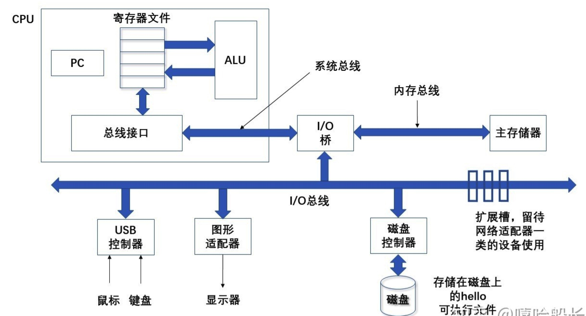

# 2、系统的硬件组成

### 典型系统硬件组成

#### 1、总线

贯穿整个系统的一组电子管道，乘坐总线，它携带信息字节并负责在各个部件间传递。

#### 2、I/O设备

`I/O` 设备是系统和外部世界的联系通道。如上图中的键盘和鼠标、作为用户输出的显示器、以及用于长期存储数据和程序的磁盘驱动器。

#### 3、主存

主存是一个临时存储设备，在处理器执行程序时，用来存放程序和程序处理的数据。

从物理上来说，主存是一组**动态随机存取存储器（DRAM）**芯片组成；从逻辑上说，存储器是一个线性的字节数组，每个字节都有其唯一的地址（数组索引）。

#### 4、处理器

中央处理单元（CPU），是解释或执行存储在主存中指令的引擎。处理器的核心是一个大小为一个字的存储设备（或寄存器），称为程序计数器（PC）。在任何时候，`PC` 都指向内存中的某条机器语言指令（即含有该条指令的地址）。

处理器从程序计数器指向的内存储读取指令，解释指令中的位，执行该指令指向的简单操作，然后更新`PC` ，使其指向下一条指令，而这条指令并不一定和在内存中刚刚执行的指令相邻。

这样的简单操作并不多，它们围绕着主存、寄存器文件和算术/逻辑单元（ALU）进行。寄存器文件是一个小的存储设备，由一些单个字长的寄存器组成，每个寄存器都有唯一的名字。`ALU` 计算新的数据和地址值。一个简单的示例如下：

* 加载：从主存复制一个字节或者一个字到寄存器，以覆盖寄存器原来的内容
* 存储：从寄存器复制一个字节或者一个字到主存的某个位置，以覆盖这个位置上原来的内容。
* 操作：把两个寄存器的内容复制到`ALU` ，它会对这两个字做算术运算，并将结果存放到一个寄存器中，以覆盖该寄存器中原来的内容。
* 跳转：从指令本身抽取一个字，并将这个字复制到程序计数器（PC）中，以覆盖`PC` 中原来的值。

### 运行hello程序

当我们在`shell` 中运行编译好的 `hello` 可执行程序时，`shell` 程序将字符逐一读入寄存器，再把它存放到内存中。

当我们敲完回车，`shell` 程序就知道我们已经结束了命令的输入，然后执行一系列命令来加载可执行的 `hello` 文件，这些指令将 `hello` 文件中的代码和数据从磁盘复制到主存，数据包最终会被输出为字符串 `hello , world/n` 。

一旦目标文件 `hello` 中的代码和数据被加载到主存，处理器就开始执行 `hello` 程序的 `main` 程序中的机器语言指令。这些指令将字符串 `hello ，world/n` 中的字节从主存复制到寄存器文件，再从寄存器文件中复制到显示设备，最终显示在屏幕上。

### 高速缓存至关重要

这个简单的示例揭示了一个重要的问题，即系统花费了大量的时间把信息从一个地方挪到另外一个地方。

`hello` 程序的机器指令最初是存放在磁盘上的，当程序加载时，它们被复制到主存；当处理器运行程序时，指令又从主存复制到处理器。

从程序员的角度来看，这些复制就是开销，减慢了程序**”真正“**的工作。因此，系统设计者的一个主要目标就是使这些复制操作尽可能快的完成。

这里得出的一个重要结论就是：

> 意识到高速缓存存储器存在的应用程序员能够利用高速缓存将程序的性能提高一个数量级。

