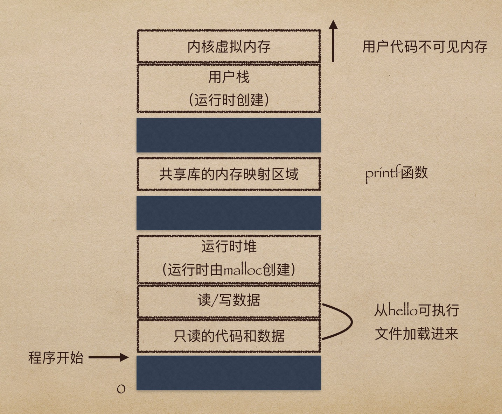

# 3、进程、线程和虚拟内存

像`hello` 这样的程序在现代系统上运行时，操作系统会提供一种假象，就好像系统上只有这个程序在运行。这些假象都是通过进程的概念来实现的。

**进程是操作系统对一个正在运行的程序的一种抽象。**

### 上下文切换

操作系统保持跟踪进程运行所需的所有状态信息。这种状态，也就是上下文，包括许多信息，比如 `PC` 和寄存器文件的当前值，以及主存和内容。在任一时刻，单处理器系统都只能执行一个进程的代码。

当操作系统决定要把控制权从当前进程转移到某个新进程时，就会进行上下文切换，即保存当前进程的上下文、恢复新进程的上下文，然后将控制权传递到新进程。

实现进程这个抽象概念需要低级硬件和操作系统软件之间的紧密结合。

### 线程

在现代系统中，一个进程实际上可以由多个称为线程的执行单元组成，每个线程都运行在进程的上下文中，并共享同样的代码和全局数据。

### 虚拟内存

虚拟内存是一个抽象概念，它为每个进程提供了一个假象，即每个进程都在独占地使用主存。

每个进程看到的内存都是一致的，称为虚拟内存空间。

在 `Linux` 中，地址空间最上面的区域是保留给操作系统中的代码和数据的，这对所有进程来说都是一样。地址空间的底部区域存放用户进程定义的代码和数据。

我们从最低的地址开始：

* 程序代码和数据。代码和数据区是直接按照可执行目标文件的内容初始化的，在示例中就是可执行文件 `hello` 。
* 堆。代码和数据区后紧随着的是运行时堆，代码和数据区在进程一开始运行时就被指定了大小，与此不同，当调用像 `malloc` 和 `free` 这样的 `C` 标准库函数时，堆就可以在运行时动态地扩展和收缩。
* 共享库。大约在地址空间的中间部分是一块用来存放像 `C` 标准库和数学库这样的共享库代码和数据的区域。
* 栈。位于用户虚拟地址空间顶部是**用户栈**。编译器用它来实现函数调用。和堆一样，用户占在程序执行期间可以动态地扩展和收缩。
* 内核虚拟内存。地址空间顶部的区域是为内核保留的。它们必须调用内核来执行这些操作。

虚拟内存的运作需要硬件和操作系统软件之间精密复杂的交互，包括对处理器生成的每个地址的硬件翻译。基本思想是把一个进程虚拟内存的内容存储在磁盘上，然后用主存作为磁盘的高速缓存。

